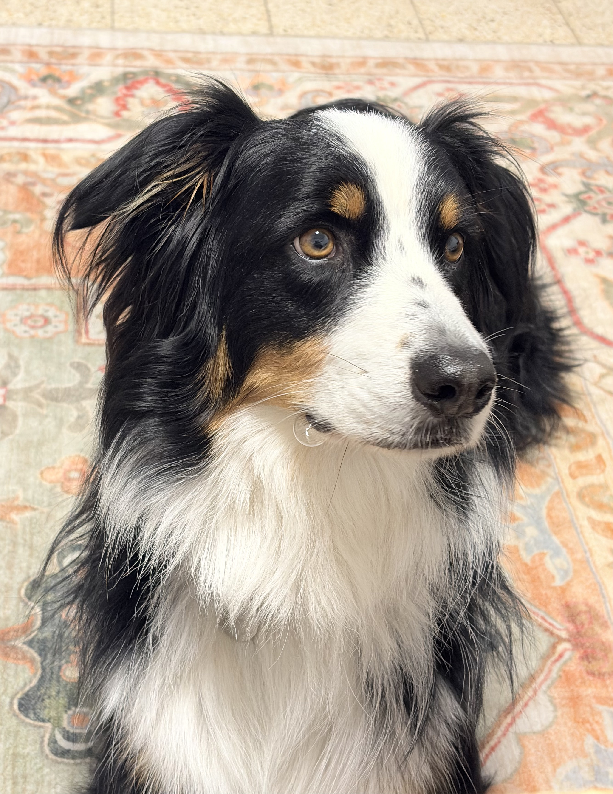

# Hi, I'm Stav 

Welcome to my GitHub website!

Yes, this website is arriving fashionably late.  
I prefer to think of it as carefully timed.

## About Me

I'm a first-year Master's student at the Weizmann Institute of Science.
I love science, exploring data, traveling, walking with my dog, and spending time at the beach.

Currently, I'm conducting my third rotation in Shalev Itzkovitz's lab, where I am investigating gallstones in the human gallbladder.

---

## Meet My Dog - Buffer

